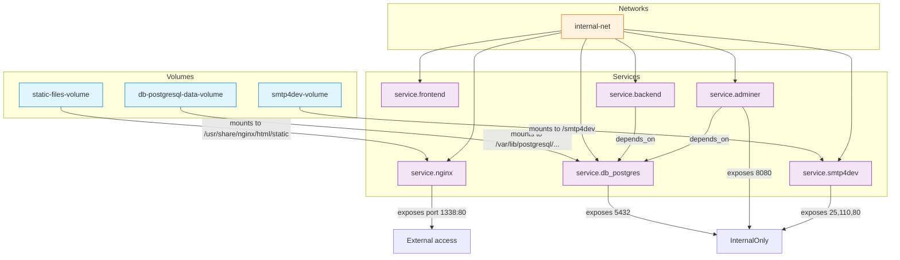

# Описание

# Docker

```mermaid
flowchart TD
    subgraph Volumes ["Volumes"]
        V1[db-postgresql-data-volume]
        V2[static-files-volume]
        V3[smtp4dev-volume]
    end

    subgraph Networks ["Networks"]
        N1[internal-net]
    end

    subgraph Services ["Services"]
        S1[service.nginx]
        S2[service.frontend]
        S3[service.backend]
        S4[service.db_postgres]
        S5[service.adminer]
        S6[service.smtp4dev]
    end

    %% Connections: volumes -> services
    V1 -->|mounts to /var/lib/postgresql/...| S4
    V2 -->|mounts to /usr/share/nginx/html/static| S1
    V3 -->|mounts to /smtp4dev| S6

    %% Connections: networks -> services
    N1 --> S1
    N1 --> S2
    N1 --> S3
    N1 --> S4
    N1 --> S5
    N1 --> S6

    %% Dependencies
    S3 -->|depends_on| S4
    S5 -->|depends_on| S4

    %% Exposes / Ports
    S1 -->|exposes port 1338:80| External["External access"]
    S4 -->|exposes 5432| InternalOnly
    S5 -->|exposes 8080| InternalOnly
    S6 -->|exposes 25,110,80| InternalOnly

    style V1 fill:#e1f5fe,stroke:#0277bd
    style V2 fill:#e1f5fe,stroke:#0277bd
    style V3 fill:#e1f5fe,stroke:#0277bd
    style N1 fill:#fff3e0,stroke:#ef6c00
    style S1 fill:#f3e5f5,stroke:#7b1fa2
    style S2 fill:#f3e5f5,stroke:#7b1fa2
    style S3 fill:#f3e5f5,stroke:#7b1fa2
    style S4 fill:#f3e5f5,stroke:#7b1fa2
    style S5 fill:#f3e5f5,stroke:#7b1fa2
    style S6 fill:#f3e5f5,stroke:#7b1fa2

```